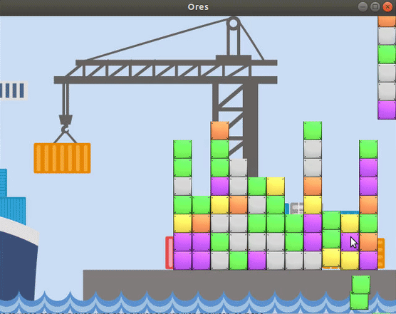

# ores-game
Ores Puzzle Game developed for an interview challange using SDL2

Apart from the basic requirements, I added an earthquake effect as an extra feature.

# Build Instructions
The repository comes with an Eclipse project ready to build having only 1 dependency: SDL.

To install SDL, follow SDL wiki instructions: http://wiki.libsdl.org/Installation#Linux.2FUnix

You will need libsdl2-dev, but also libsdl2-image-dev. On Ubuntu, these should be enough:

- sudo apt-get install libsdl2-dev
- sudo apt-get install libsdl2-image-dev

